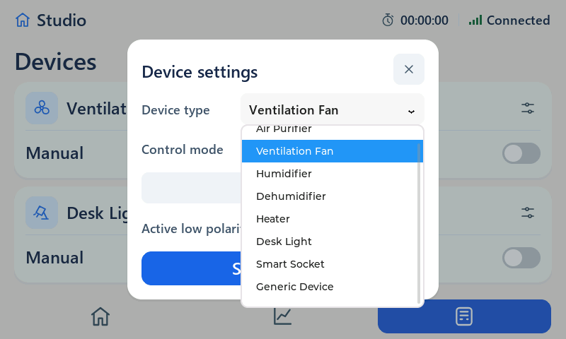
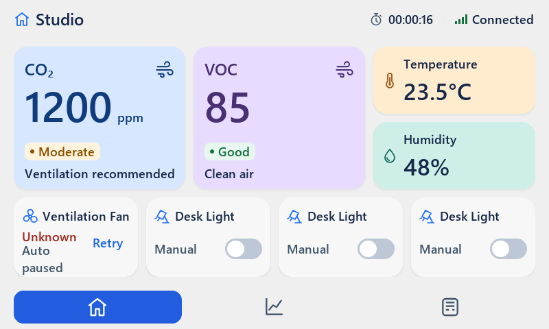

# Independent review of the L1–L6 implementation result

Date: 2026-09-15. Verdict: **CHANGES REQUIRED — main layout improved; acceptance incomplete**.

Scope: current working tree, owner's implementation transcript, active handoff,
implementation report/screenshots and targeted independent host checks. No UI,
controller, production test or prompt changes in this review turn. New diagnostic
sources and captures in this folder are review-only, never MCU exports.

## Findings

### V1 [P2] The new restore example cannot compile against the actual API

`docs/user/SMART_HUB_UI_GUIDE.md:442` accesses
`offsetof(ui_hub_device_config_v1_t, schema_version)`, but the legacy struct in
`ui_types.h:65-70` has no schema_version member. Line 446 then calls migration
with two arguments; the actual function in `ui_auto.h:86` requires three:
`(const void *src, size_t src_sz, ui_hub_device_config_t *dst)`.

The independent [syntax reproduction](restore-api-check.c) fails with both errors.
This blocks using the copyable firmware integration example; it is NOT a failure
of the existing runtime migration function, whose correctly called tests pass.

Correction: use real legacy record metadata/known length, not a nonexistent
in-struct version field; call migration with the actual length and check its
return. Compile/test the example or a shared adapter against real headers,
including missing/current/legacy/truncated/unknown records. No Flash driver needed.
Also avoid replacing all missing records with Generic if the intended default
four appliances should remain: current example changes their preset defaults.

### V2 [P2] The open preset dropdown misses the typography/touch/layout requirements

`ui.c:2020-2042` styles only the closed dropdown. Its separate LVGL list retains
default theme styling. Independent measurement from an actual opened list:

```text
font == ui_font_18:          0
font == lv_font_montserrat_14: 1
line_height=16, line_spacing=16, option pitch=32 px
list bounds:  (340,176)..(599,435)
modal bounds: (180,56)..(619,423)
```

Visible text is font 14 rather than >=18, options are only 32 px high rather than
>=44, and the popup extends 12 px below the modal. The default visible border also
does not match the borderless styling requested for this UI.



Correction: style the list/selected option as well as the closed control; use
font18 and >=44 px option pitch with appropriate scrollable viewport bounds.
Check first/last options, selection and cancellation by real pointer input. Preserve
current modal footprint; do not enlarge the heap to accommodate the fix.

### V3 [P2] Acceptance evidence still does not cover the promised paths

- The scenario named `home_auto_paused.raw` at `sim_pc/main.c:3019-3041` is described
  as Auto paused on error. Its submitted PNG actually shows ordinary Auto with a
  normal switch, no timeout/paused/Retry. Scenario generation saves without first
  asserting the expected command phase/latch. It therefore cannot prove the
  error-state layout. A separate sensor-pause screenshot is not equivalent.
- The historical `check.c cancel` that the report says cancels an invalid draft
  never makes the draft invalid. It does prove ordinary pointer cancellation of
  two separately opened views. Do not overstate that result.
- Required new maintained tests (dropdown item geometry, invalid pointer cancel,
  compiled restore integration, recording TX loop, full state/action geometry and
  combined page/dropdown/invalid-editor stress) are not wired into the normal
  regression suite. Extra scenario PNGs and separately invoked review diagnostics
  are not a substitute for those assertions.
- The report's claimed peak of 80% used / 8808 free is not the tested peak. This
  independent rerun reports ordinary dialog **88% used / 5224 free**, largest block
  4264. The bounded dropdown stress has minimum free 5048, largest 3824. All remain
  within the existing total-free threshold; the defect is inaccurate evidence,
  not a demonstrated heap exhaustion or leak.
- The stress diagnostic checks total free space during a bounded 50-cycle sequence;
  it does not calculate stable-state drift or prove zero leaks. The separate
  maintained page test reports 50 cycles and -24 bytes used-memory drift, not the
  report's 10-cycle description.

Correction: assert scenario preconditions before saving images; promote relevant
checks to the normal suite, compile integration examples and report actual
per-state/peak/drift measurements. Keep failing/unverified items OPEN.

### V4 [P3] Error/offline Home tiles are still bottom-heavy

The old status/switch overlap is fixed horizontally. However, error/offline states
now stack Unknown + Auto + paused in the narrow left column without rebalancing
vertical spacing. Independent actual timeout bounds:

```text
state: (32,332)..(111,356)
mode:  (32,352)..(123,401)
tile:  (20,288)..(200,403)
retry: (135,341)..(188,384)
```

The mode box leaves only 2 px to the outer bottom, and state/mode line boxes
intersect by 5 px. The screenshot does not show glyphs colliding, so this is
spacing/optical polish, not a claim of unreadable overlapping characters or a
broken Retry target. It still differs noticeably from normal card padding.



Correction direction: design the whole status block as a state-specific group,
including its padding and Retry alignment, rather than only wrapping the old
label. Keep >=18 px text and honest paused/unknown semantics. Do not change the
now-balanced metric cards or redo the overall palette/layout.

## What is now working

- Native normal Home: Temperature/Humidity use balanced two-line groups; invalid
  and offline captures use a dash with compact truthful copy. No false comfort
  footer. Keep this composition.
- Device/Auto settings have consistent rows, fixed Save and usable stepper sizes.
  Invalid validation fits two lines without moving the footer. The open dropdown
  is the unfinished part, not a reason to undo the modal redesign.
- VOC context no longer displays `(index)`; canonical Auto limits are unchanged.
- Offline Auto caption now reads Auto paused. Manual remains Manual.
- Pointer X on both views, actual pending-polarity refusal, and pointer readback
  switches on both pages/polarities pass the retained independent diagnostics.
- The LORA_GUIDE send example now gates periodic and sequence-triggered TX after
  reconciliation. This closes the earlier bare-send documentation issue; a
  recording integration-loop test remains missing.
- Production verification now builds a separate LVGL library with the isolated
  configuration and staged UI source copies, no UI_TEST_HOOKS. Its clean run and
  strict negative control both pass outside the sandbox. This is a real improvement
  over the previous same-tree library reuse.

## Verification performed

1. `tools/build_sim.bat`: exit 0, cached LVGL reused; CMake CMP0177 developer warning.
2. `sim_pc/build/sim_pc.exe --regression`: exit 0, 24/24. Home identical-frame
   refresh remains zero flushes; page-cycle drift -24 bytes, fragmentation +0%.
3. Recompiled the historical layout review diagnostic against current sources,
   without editing it; ran cancel/pending/switches/link_pause/stress: each exit 0.
   Did not run its layout case because it writes into the prior review's raw file.
4. New `check.c dropdown`: exit 1, incorrect list font/row bounds measured above.
5. New `check.c timeout`: exit 0; asserted real ERROR phase and latched Auto error
   before capturing. This test intentionally does not claim error layout acceptance.
6. `restore-api-check.c` with GCC `-fsyntax-only -Wall -Wextra -Werror`: exit 1,
   nonexistent member and wrong migration-call arguments.
7. `tools/verify_production.bat`: initial sandboxed attempt stalled at CMake compiler
   ABI detection and was interrupted. An approved outside-sandbox rerun completed
   exit 0: separate LVGL/UI compile, clean smoke exit 0 and deliberate failure exit
   1 with the exact expected stderr. Target MCU/radio/LCD/touch remain untested.

The verifier still copies a second manually maintained root-source list instead
of consuming the export artifact itself. It proves this isolated source set builds,
but does not fully prove the ZIP's contents match. Consolidate the manifest or build
the produced artifact in future verification. Process watchdogs are also still
missing from its unbounded smoke launch/WaitForExit; the initial stall was an
environmental limitation, not proof of a production code bug.

### Reproduction commands

Run from repo root; `.codex-tmp` already existed in this checkout.

```powershell
C:\Toolchains\w64devkit\bin\gcc.exe -O2 -std=gnu11 -DNDEBUG -DLV_CONF_INCLUDE_SIMPLE -DLV_LVGL_H_INCLUDE_SIMPLE -DUI_TEST_HOOKS -I. -Isim_pc -Isim_pc/build/_deps/lvgl-src docs/reviews/2026-09-15-auto-layout-result-review/check.c sim_pc/ui_test_api.c ui_auto.c ui_theme.c ui_icons.c ui_fonts.c ui_splash_logo.c sim_pc/build/lib/liblvgl.a -lgdi32 -luser32 -o .codex-tmp/layout-result-extra.exe
.codex-tmp/layout-result-extra.exe dropdown
.codex-tmp/layout-result-extra.exe timeout
C:\Toolchains\w64devkit\bin\gcc.exe -std=c11 -fsyntax-only -Wall -Wextra -Werror -I. docs/reviews/2026-09-15-auto-layout-result-review/restore-api-check.c
python tools/raw2png.py docs/reviews/2026-09-15-auto-layout-result-review/dropdown.raw docs/reviews/2026-09-15-auto-layout-result-review/dropdown.png
python tools/raw2png.py docs/reviews/2026-09-15-auto-layout-result-review/timeout.raw docs/reviews/2026-09-15-auto-layout-result-review/timeout.png
```

Each new diagnostic process has a 10-second watchdog. PNGs are native 800x480
RGB565 conversions, not resized/repainted mockups. No production fix, new prompt,
commit, push or branch operation is part of this review.
