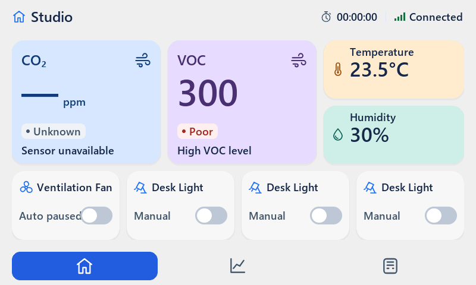

# Auto v1 follow-up review — spacing and remaining acceptance gaps

Date: 2026-09-15. Verdict: **CHANGES REQUIRED**.

Reviewed the current dirty working tree, the owner's latest implementation
transcript, the previous handoff and the author's
[submission report](../2026-09-15-auto-v1-fixes/REPORT.md). This is an independent
host/source/visual review, not target hardware acceptance. No production UI code
was changed. The next implementation instructions are only in
[CURRENT.md](../../prompts/CURRENT.md).

## Findings, ordered by severity

### L5 [P1] A copyable TX example still bypasses synchronization

`docs/user/LORA_GUIDE.md:583` section 9.2 still instructs periodic/sequence-change
TX with a bare `lora_send(lora_hub_cmd.bytes, LORA_HUB_CMD_LEN)` and no readiness
gate. This contradicts the corrected main-loop example in SMART_HUB_UI_GUIDE.
A firmware author copying this snippet can transmit before initial reconciliation
or after loss, defeating the existing protection. This is a documentation/integration
defect; this review does not claim the corrected simulator send gate is broken.

The Flash sample in `docs/user/SMART_HUB_UI_GUIDE.md:416` also still reads directly
into the expanded config and leaves migration as a comment. Actual serialized
length/version dispatch was required but is not demonstrated. No Flash driver is
in scope: provide safe bounded examples and a recording host integration test.

### L6 [P2] Production verification is not an isolated export build

`tools/verify_production.ps1:20-31` runs the manifest check and builds the existing
simulator-tree smoke target. `sim_pc/CMakeLists.txt:35-51` compiles root UI sources
and links the same LVGL library/config as the simulator. No export staging,
independent LVGL configuration/build or clean exported-source link/run occurs.
The Release smoke now genuinely detects an intentionally failed check, but the
broader R9 acceptance requirement remains open.

The negative-control script also catches launch exceptions and assigns failure
code 1, subsequently accepting any nonzero code. A failed launch is not evidence
that an assertion ran. Require successful launch and the deliberate expected
code/message; propagate crashes/launch errors as verification failure.

The author's evidence has additional coverage limitations:

- The historical `check.c close` branch opens Auto only if Device X failed. After
  fixing X, the printed second success no longer represents an Auto-view test.
- The historical `api_hold` case no longer enters pending after the hold fix;
  its output explicitly says phase=0, so it cannot prove pending-edit rejection.
- Its default/fallback print is a runtime rejected edit, not a stored-record boot
  deserialization test. Observation harness exit 0 is not an assertion.
- The reported 50-cycle values match the maintained **page** navigation test;
  the supplied transcript starts then kills a separate stress process without
  successful completion output. This does not establish full modal stress.
  The new independent limited modal/dropdown test below passes; broader invalid
  editor + page cycle/heap drift coverage is still needed after layout changes.

### L3 [P2] Home Auto paused text intersects the switch

`ui.c:990-1040` selects the longer text but retains the same unrestricted label
and switch layout. Measured native object bounds:

```text
Mode 'Auto paused': (32,350)..(137,374)
Switch:            (135,348)..(188,377)
```

There is a 3 px horizontal intersection and overlapping vertical ranges.
The assertion in `check.c layout` fails with exit 1. It reproduces on a configured
Fan in slot 0; the author's slot-1 screenshot shows the same issue.



Use bounded status/action areas for all four tiles and all transient states.
Do not solve it by shrinking text, hiding pause status, or reverting to optimistic
switch position. Review Sending/Unknown/Retry combinations too.

### L4 [P2] Auto remains labelled Auto during link suspension

`ui.c:990-993` and the equivalent Devices mode selection use only the sensor/error
flags, not link state. `ui_tick()` correctly stops Auto while offline but does not
set those flags for an ordinary link loss. Independent test after a healthy Auto
frame and 6000 ms without RX prints:

```text
Offline Auto caption: 'Auto' (expected Auto paused)
```

`check.c link_pause` exits 1. This is a display-state inconsistency, not evidence
of offline automatic actuation. Use the current link suspension in the shared
display policy; do not conflate it with a latched timeout or change relay policy.

### L1 [P2] Settings hierarchy, alignment and touch sizing remain unfinished

Visually inspected the author's native Device, Auto and invalid-draft PNGs.
`ui.c:1974-2234` still uses individually positioned controls: asymmetric gaps,
unrelated threshold label/value/button anchors and a large void after Reset.
Reset and Set limits are only 36 px high, mode buttons 40 px and dropdown 42 px;
no expanded hit targets are set there. These miss the requested >=44 px targets.
Invalid text has a separate ad-hoc slot. The modal has enough room if Device
fields become horizontal rows and Auto rows share explicit columns.

The visible Purifier context also derives `(index)` from ui_auto.c's rule metadata;
the owner's visible-label decision was VOC without Index. Remove that UI suffix,
not the data field/meaning.

### L2 [P2] Small metric cards retained a three-line layout after footer removal

`ui.c:822-864` places titles at padded y=-4 and values at y=14, keeping the old
footer object at y=58. Clearing its normal text leaves the title/value group
top-heavy. The screenshot confirms excess bottom space relative to the top.
This is not a reason to restore unvalidated Ideal/comfort claims.

Keep the card bounds/colors. Center a shared 75 px two-line group using actual
25/46 px line heights; retain compact truthful missing/offline indication within
the value row. The concrete lead-selected geometry is recorded in the design
brief and CURRENT, not an additional prompt in this folder.

## Previous fixes independently confirmed within the tested scope

- Default modes are Manual; healthy readings for 14 seconds do not command the
  default outputs. Unknown schema is rejected. Source retains Manual migration.
- Pre-init active_low is preserved; boot TX starts blocked; all 16 reconnect raw
  GPIO masks reconcile correctly in the historical diagnostic.
- Real pointer X now closes BOTH independently reopened subviews (new test).
- A real pointer polarity edit survives Set limits and Save (historical diagnostic).
- A live polarity edit creates a real pending command; a second unsafe edit is
  rejected atomically, without callback or packet mutation (new test).
- Real pointer switches on Home/Devices and both polarities keep old reported
  positions until ACK, then change (new test). This test uses Manual mode; the
  full Auto/timeout/retry matrix is not independently covered here.
- Invalid CO2 displays Auto paused and cannot actuate during the first 3 seconds
  after recovery. The old reconnect reproduction retains paused_error=1.
- The canonical threshold table is restored in ui_auto.h.
- Updated chart Y-label pixels match a forced redraw; ten identical Trends
  frames/refeeds produce zero flushes/pixels in the historical diagnostic.
- Release smoke's normal run exits 0; actual --fail-check exits 1 in this run.

These are targeted confirmations, not a claim that every former R1–R10 acceptance
case is now implemented. Keep successful fixes while closing L1–L6 and test gaps.

## Commands and actual results

From repo root:

```powershell
tools/build_sim.bat
tools/verify_production.bat
.\sim_pc\build\sim_pc.exe --regression
```

All returned exit 0. Build reused cached LVGL and emitted a CMake CMP0177 developer
warning (no compiler error). Regression: 24/24; ordinary dialog free heap 5424,
largest block 4464; 50 page-cycle used-memory drift -8 bytes, fragmentation +0%.
Production script passed manifest and same-tree Release smoke; it does not satisfy
the isolated-export check described above. This turn did not run the complete
run_regression.bat wrapper/15-scenario generator or target hardware tests.

Compile the new read-only review diagnostic:

```powershell
C:\Toolchains\w64devkit\bin\gcc.exe -O2 -std=gnu11 -DNDEBUG -DLV_CONF_INCLUDE_SIMPLE -DLV_LVGL_H_INCLUDE_SIMPLE -DUI_TEST_HOOKS -I. -Isim_pc -Isim_pc/build/_deps/lvgl-src docs/reviews/2026-09-15-auto-v1-layout-review/check.c sim_pc/ui_test_api.c ui_auto.c ui_theme.c ui_icons.c ui_fonts.c ui_splash_logo.c sim_pc/build/lib/liblvgl.a -lgdi32 -luser32 -o .codex-tmp/layout-review.exe
```

`.codex-tmp` existed in this reviewed checkout; create it if absent in a fresh
checkout. Each case runs in a separate process with a 10-second watchdog:

| Invocation after `.codex-tmp/layout-review.exe` | Exit | Result |
|---|---:|---|
| cancel | 0 | Both separately opened subviews close by pointer; no save callback |
| pending | 0 | Actual pending edit refusal, callback and packet assertions pass |
| switches | 0 | Both pages and polarities retain readback until ACK |
| layout | 1 | Auto paused overlaps switch; captures native framebuffer |
| link_pause | 1 | Offline Auto caption remains Auto |
| stress | 0 | 50 modal/dropdown/Auto-view/X cycles; min free 5216, min biggest 3992 |

The stress test intentionally measures this bounded sequence only; it does not
establish all-state peak usage, fragmentation drift or target fragmentation.
The 3992-byte largest block is distinct from 5216 total free bytes.

The same compile command with the old review's check.c and a different output exe
was used to run defaults, boot, chart, polarity_draft, recovery and error_reconnect.
Their observed results are listed above. No old source/evidence was edited.

Native capture conversion (no resize):

```powershell
python tools/raw2png.py docs/reviews/2026-09-15-auto-v1-layout-review/home-paused.raw docs/reviews/2026-09-15-auto-v1-layout-review/home-paused.png
```

## Handoff disposition

New layout/copy direction is selected by the technical lead under the owner's
delegation. Keep all existing colors, borderless surfaces, outer card/modal bounds,
wire contract and threshold policy. No production implementation in this review
turn, no commit/push. The next coding agent must submit real 800x480 renders and
tests; its own report is not independent acceptance.
