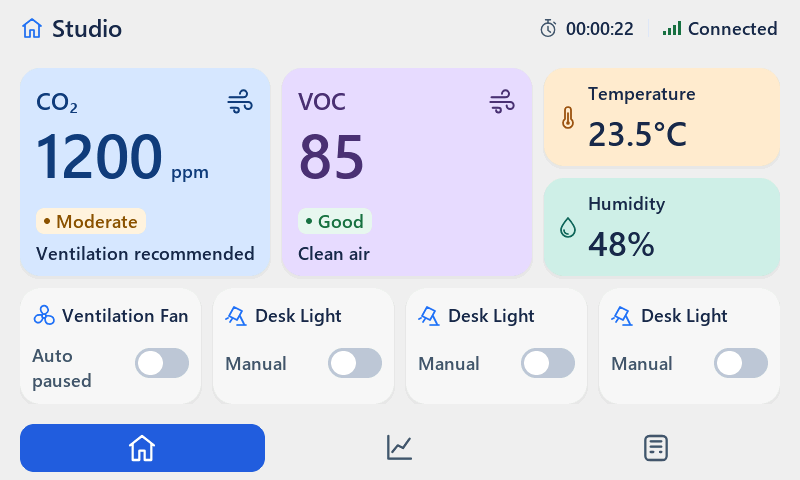

# Independent review of the V1–V4 corrective implementation

Date: 2026-09-15. Verdict: **CHANGES REQUIRED**.

The main visual corrections are satisfactory in the inspected native screenshots.
Do not repeat the broad redesign. The remaining work concerns re-arm usability,
transient heap headroom, truthful regression coverage and export-file ownership.
This review changes only diagnostics/documentation/handoff, not production code.

## W1 [P2] Retry disappears while Auto's timeout latch is still active

`ui.c:1020-1084` and `ui.c:1558-1599` show Retry only for command phase ERROR.
Reconnect synchronization or a matching late readback changes that phase to IDLE
while intentionally preserving `paused_error`. The result is Auto paused without
the Retry control on both Home and Devices.

Independent fresh-process sequences in [check.c](check.c):

```text
timeout -> reconnect: phase=0 latch=1 Home Retry visible=0; Devices visible=0
timeout -> late ACK:  phase=0 latch=1 Home Retry visible=0; Devices visible=0
```

Both assertions exit 1. Before recovery, the test confirms ERROR + latch and
visible Retry. It does not inject the latch or invoke the retry callback directly.



The user can still deliberately switch Manual -> Auto through settings; this is
NOT total loss of all recovery routes. However, the explicit Retry route required
by the handoff has vanished. CHECK 30 calls `ui_trigger_device_retry()` directly,
so it succeeds even when no corresponding button can be tapped.

Keep a visible pointer-accessible re-arm while online with a latched Auto error,
independent of command phase. Preserve fresh readback honestly; do not clear the
latch automatically or mark known output Unknown merely to make Retry appear.

## W2 [P2] The reported peak excludes the expensive states; actual transient headroom fails

`sim_pc/main.c:3263-3339` CHECK 31 opens/closes dialogs and a dropdown, but calls
`lv_mem_monitor()` only after returning to Home. Its reported minimum7784/peak82%
is not a whole-cycle minimum/peak. The loop does not create an invalid pair or
measure fragmentation at its checkpoints either.

After the current 31-test suite passes, the independent probe navigates to
Devices and samples each open view, using normal application-context LVGL ticks:

| Checkpoint | Free bytes | Largest block | Used |
|---|---:|---:|---:|
| Devices | 11608 | 9784 | 74% |
| Device settings, first rendered checkpoint | 3896 | 3800 | 91% |
| Same settings after another 40 ms | 4744 | 3800 | 89% |
| Dropdown open | 4408 | 3800 | 90% |
| Auto limits, first rendered checkpoint | 4024 | 3928 | 91% |

The minimum-total-free assertion exits 1: 3896 and 4024 are below the specified
>4096-byte reserve. Settings recovering to4744 shows that the first dip is transient;
this is not evidence of a progressive leak or an observed allocation failure.
Transition peaks still count under the handoff's all-state headroom requirement.

A separate cold-process historical 50-dropdown-cycle diagnostic passed with
minimum4424/largest3040. This does not negate the later-sequence transition dip.
Do not replace either observation with a universal hardware memory claim.

Measure while each expensive state actually exists, including subview transitions,
invalid draft and popup. Fix the transient allocation/lifecycle cost without
increasing42KiB, hiding the first frame from measurement or weakening the reserve.

## W3 [P2] Several new tests still bypass the behavior their names claim

- CHECK 29 (`sim_pc/main.c:3142-3181`) has no recording TX stub or assertions on
  transmitted packets/times/order. It checks readiness and a changed command seq.
  It cannot prove periodic/new-sequence send gating or boot/reconnect ordering.
- CHECK 30 (`sim_pc/main.c:3186-3257`) checks enable hold, timeout and reconnect,
  but never invalidates/restores a sensor despite the Sensor Recovery Hold name.
  Its helper-based Retry conceals W1.
- `sim_pc/test_restore_integration.c` compiles the now-correct adapter, but forces
  boot semantics in a running UI via `ui_test_set_boot_staging(true)`. This is
  useful adapter coverage, not an actual pre-ui_init production boot test. The
  promised every-truncation-length/unknown-schema/malformed-metadata matrix is
  not present; only selected cases are tested.
- CHECK 27 creates invalid thresholds with helper calls rather than real stepper
  gestures; it tests pointer X, not the full pointer edit/Back/Cancel path. It
  installs its callback counter only after the cancellation, so that counter
  does not establish zero callbacks during invalid-draft cancellation.
- CHECK 26 issues a drag then programmatically resets scrolling without asserting
  that dragging changed the viewport; only one option's selection is asserted.
  Its geometry/font checks and observed dropdown improvements are nevertheless real.

These are test/evidence defects, not proof that every underlying feature is broken.
Replace assertions with real entry-point/state/packet observations; keep the parts
that already pass. Do not just rename these tests while declaring old requirements met.

## W4 [P2] Production verification may overwrite a pre-existing export ZIP

`tools/verify_production.ps1:119-141` discovers ownership by comparing before/after
root ZIP filenames, then invokes the exporter. `tools/export_mcu.bat:32-34` names
the ZIP only to the minute and uses `Compress-Archive -Force`.

If an archive already exists for that minute, verification overwrites it before
the filename diff can notice; the file then is not considered newly created.
Concurrent export/verification also makes directory-diff ownership unreliable.
This is a source-proven overwrite path, not a destructive test performed on user data.

Use a caller-owned unique temporary output path for verification (or refuse an
existing destination atomically), and track exact returned artifact paths. Do not
infer ownership from a root directory diff or delete another invocation's output.
Test preservation/concurrency only with disposable fixtures, never existing user ZIPs.

## Confirmed improvements / accepted direction

- Corrected restore example uses record provenance and the real three-argument
  migration function; channel defaults are preserved. CHECK25 compiles it.
- Open dropdown now uses font18,44px option pitch, no border and bounded viewport;
  selection/outside dismiss/X have maintained pointer coverage.
- The actual timeout screenshot now shows Auto paused/Unknown/Retry, with balanced
  metadata rows. Keep this layout and the already balanced small metric cards.
- Current build and31 regressions pass; identical Home frames still zero flushes.
- Production verification now consumes the exported package, rebuilds LVGL with
  its isolated configuration, runs production UI without test hooks, and verifies
  exact negative-control exit1/message. Watchdogs are present. Do not reopen the
  previous same-tree-library or missing-API findings as if they were unchanged.

## Independent checks and reproduction

- `tools/build_sim.bat`: exit0; cached dependency reused; CMP0177 CMake dev warning.
- `sim_pc/build/sim_pc.exe --regression`: exit0,31/31. CHECK8 itself reports
  ordinary dialog free4888/89% used, already inconsistent with a universal82% peak.
- Historical layout diagnostic recompiled against current source: stress exit0,
  minimum4424/largest3040. No historical diagnostic source/capture overwritten.
- New diagnostic: reconnect exit1, late_ack exit1, heap_after_suite exit1.
- `tools/verify_production.bat`: approved outside-sandbox execution, exit0;
  package membership16, separate build, smoke exit0, negative exit1/message correct.
  Before running, this reviewer checked that no root export ZIP existed to avoid
  the W4 collision. This preflight is not a concurrency-safe fix for the script.
- Inspected native submitted dropdown-top/bottom, actual timeout and retry images;
  also inspected the independently generated reconnect image above.

Compile the new probe from repository root (`.codex-tmp` already exists here):

```powershell
C:\Toolchains\w64devkit\bin\gcc.exe -O2 -std=gnu11 -DNDEBUG -DLV_CONF_INCLUDE_SIMPLE -DLV_LVGL_H_INCLUDE_SIMPLE -DUI_TEST_HOOKS -I. -Isim_pc -Isim_pc/build/_deps/lvgl-src docs/reviews/2026-09-15-auto-v1-v4-independent/check.c sim_pc/ui_test_api.c sim_pc/test_restore_integration.c ui_auto.c ui_theme.c ui_icons.c ui_fonts.c ui_splash_logo.c sim_pc/build/lib/liblvgl.a -lgdi32 -luser32 -o .codex-tmp/v1v4-extra.exe
.codex-tmp/v1v4-extra.exe reconnect
.codex-tmp/v1v4-extra.exe late_ack
.codex-tmp/v1v4-extra.exe heap_after_suite
python tools/raw2png.py docs/reviews/2026-09-15-auto-v1-v4-independent/reconnect.raw docs/reviews/2026-09-15-auto-v1-v4-independent/reconnect.png
```

The probe has a15-second watchdog; heap_after_suite prints31 passing baseline checks
before its additional failing assertion. Failure is the independent assertion,
not a failed baseline test. No physical MCU/LCD/touch/radio/load validation occurred.

Per the owner's automatic-handoff rule, [CURRENT.md](../../prompts/CURRENT.md)
contains the next scoped fix. No production implementation, commit or push in this turn.
